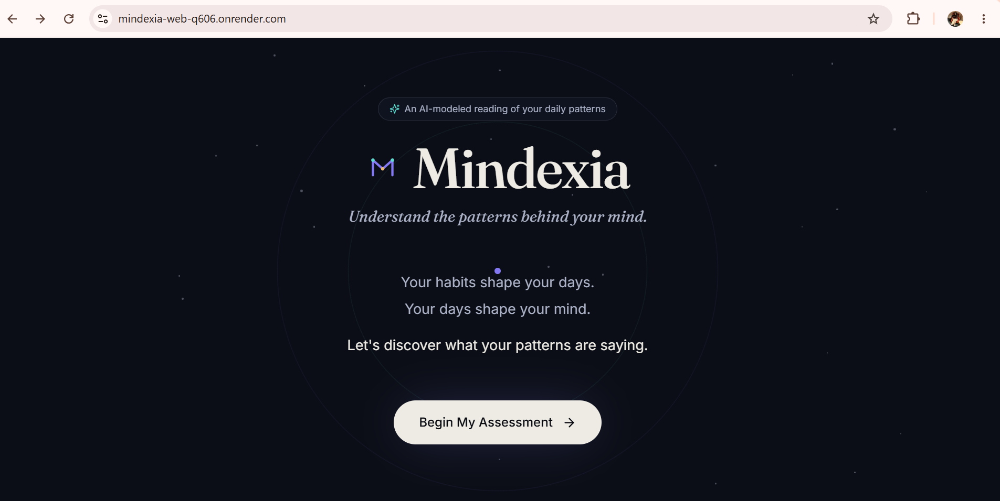
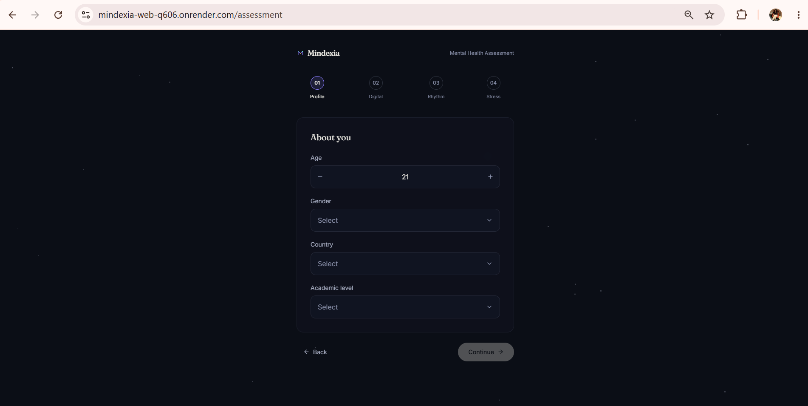
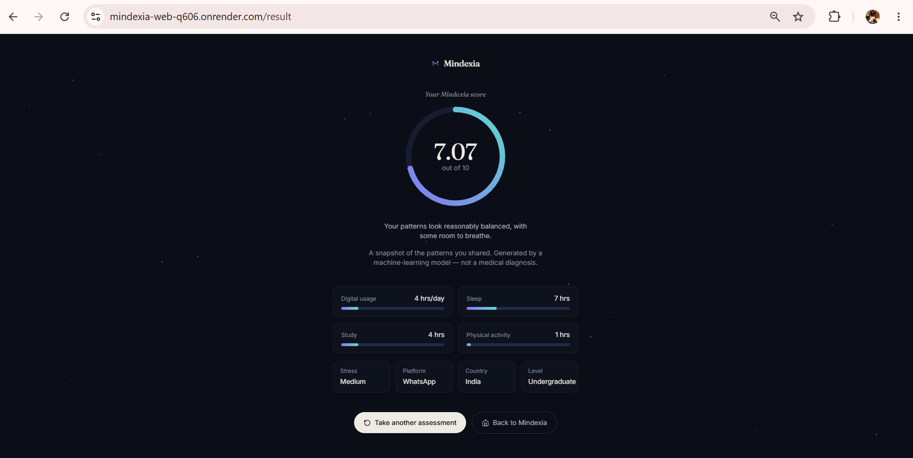

# 🧠 Mindexia — Mental Health Score Prediction

  <strong>AI-powered web application for predicting mental health scores using Machine Learning.</strong>

---

## 🌐 Overview

**Mindexia** is a full-stack Machine Learning application that predicts a student's **Mental Health Score** based on academic, lifestyle, stress, and social-media usage factors.

Users complete an interactive assessment, and the data is sent from the React frontend to a FastAPI backend. A trained **Random Forest Regressor** then generates the predicted score.

---

## 🔗 Project Links

- 🌐 **Live Website:** https://mindexia-web-q606.onrender.com
- 💻 **GitHub Repository:** https://github.com/debikadas1139-max/Mindexia
- ⚙️ **Backend API / Swagger:** https://mindexia-web.onrender.com/docs
- 🚀 **Backend Service:** https://mindexia-web.onrender.com

---

## ✨ Features

- 🧠 ML-based mental health score prediction
- 📋 Multi-step interactive assessment
- 🎨 Modern animated user interface
- ⚡ React + Vite frontend
- 🚀 FastAPI backend
- 🌲 Random Forest Regression
- 📊 Scikit-learn preprocessing pipeline
- 🔐 Pydantic validation
- 📱 Responsive design
- ☁️ Frontend and backend deployed on Render

---

## 🏗️ Architecture

    User
      ↓
    React Frontend
      ↓
    FastAPI REST API
      ↓
    Preprocessing Pipeline
      ↓
    Random Forest Regressor
      ↓
    Mental Health Score
      ↓
    Result Page

---

## 📂 Project Structure

    MINDEXIA/
    │
    ├── backend/
    │   ├── main.py
    │   ├── Mental_Health_Model.pkl
    │   └── requirements.txt
    │
    ├── frontend/
    │   ├── src/
    │   │   ├── components/
    │   │   ├── pages/
    │   │   └── services/
    │   │       └── api.js
    │   ├── package.json
    │   └── vite.config.js
    │
    ├── .gitignore
    └── README.md

---

## 🤖 Machine Learning

### Dataset

- 5,000 records
- 13 features
- Target: `Mental_Health_Score`

### Model

**Random Forest Regressor**

    n_estimators = 200
    max_depth = 15
    random_state = 42

### Preprocessing

- StandardScaler
- OrdinalEncoder
- OneHotEncoder
- `log1p()` transformation

### Model Performance

| Metric | Score |
| ------ | ----: |
| R²     | 0.873 |
| MAE    | 0.358 |
| MSE    | 0.224 |
| RMSE   | 0.473 |

> These metrics represent performance on the project's dataset and do not indicate clinical validation.

---

## 🛠️ Tech Stack

### Frontend

- React
- Vite
- JavaScript
- Tailwind CSS
- Framer Motion

### Backend

- Python
- FastAPI
- Uvicorn
- Pydantic
- Pandas
- Joblib

### Machine Learning

- Scikit-learn
- Random Forest Regressor

### Deployment

- Render

---

## 🔌 API

### Prediction Endpoint

    POST /predict

### Example Request

    {
      "age": 21,
      "gender": "Female",
      "country": "India",
      "academic_level": "Undergraduate",
      "most_used_platform": "Instagram",
      "purpose_of_use": "Entertainment",
      "avg_daily_usage_hours": 5,
      "daily_unlocks": 120,
      "study_hours": 4,
      "physical_activity_hours": 1.5,
      "sleep_hours_per_night": 7,
      "stress_level": "Medium"
    }

### Example Response

    {
      "predicted_mental_health_score": 7.24
    }

---

## ☁️ Deployment

Both the **frontend and backend are deployed using Render**.

    GitHub
      │
      ├── Render Static Site
      │       ↓
      │   React Frontend
      │
      └── Render Web Service
              ↓
          FastAPI Backend
              ↓
          ML Model

The frontend communicates with the backend using the environment variable:

    VITE_API_BASE_URL

The production backend API is hosted at:

    https://mindexia-web.onrender.com

---

## 💻 Run Locally

### Backend

    cd backend
    py -3.13 -m venv venv
    venv\Scripts\activate
    pip install -r requirements.txt
    uvicorn main:app --reload

Backend:

    http://127.0.0.1:8000

Swagger API Documentation:

    http://127.0.0.1:8000/docs

### Frontend

    cd frontend
    npm install
    npm run dev

Frontend:

    http://localhost:5173

---

## 📸 Screenshots

---

## 🚀 Future Improvements

- Personalized wellness suggestions
- Prediction history
- User authentication
- Database integration
- Model explainability
- Automated testing
- Improved mobile experience
- Continuous model retraining

---

## 🧠 Disclaimer

Mindexia is an **educational Machine Learning project** and is not a medical or clinical diagnostic system.

The predicted score should not be considered a medical diagnosis or a substitute for professional mental-health advice.

---

## 👩‍💻 Author

**Debika Das**

B.Tech — Artificial Intelligence & Machine Learning  
Narula Institute of Technology
